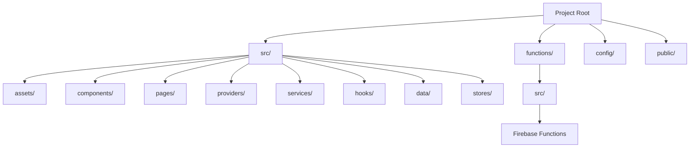
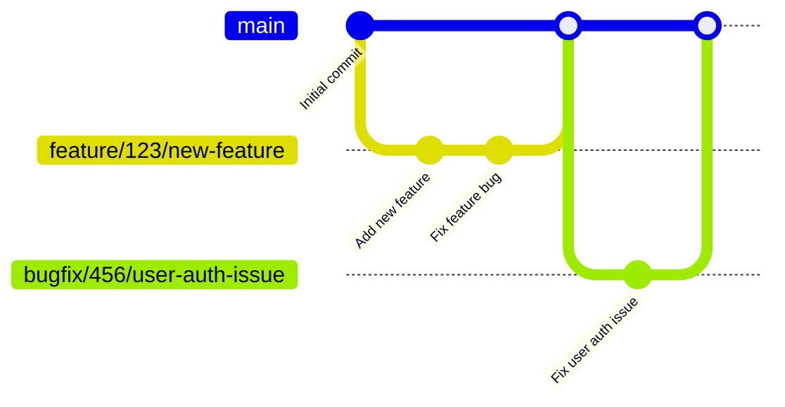
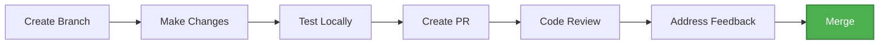
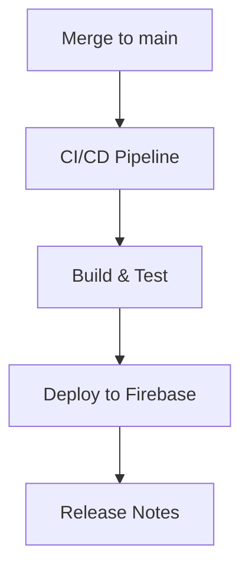

# <div align="center">🤝 Contributing to HawkHacks Dashboard</div>

<div align="center">
  <p>Thank you for your interest in contributing to the HawkHacks dashboard!</p>
  <p>This document provides guidelines and instructions for contributing to this project.</p>
  
  
  
  
</div>

## 📋 Table of Contents

- [Development Environment Setup](#-development-environment-setup)
- [Project Structure](#-project-structure)
- [Development Workflow](#-development-workflow)
- [Coding Standards](#-coding-standards)
- [Pull Request Process](#-pull-request-process)
- [Firebase Configuration](#-firebase-configuration)
- [Deployment](#-deployment)

<hr/>

## 🛠️ Development Environment Setup

### Prerequisites

<table>
  <tr>
    <th>Software</th>
    <th>Version</th>
    <th>Installation Guide</th>
  </tr>
  <tr>
    <td>Node.js</td>
    <td>v18 or higher</td>
    <td><a href="https://nodejs.org/">Installation Guide</a></td>
  </tr>
  <tr>
    <td>pnpm</td>
    <td>Latest</td>
    <td><a href="https://pnpm.io/installation">Installation Guide</a></td>
  </tr>
  <tr>
    <td>Git</td>
    <td>Latest</td>
    <td><a href="https://git-scm.com/downloads">Installation Guide</a></td>
  </tr>
  <tr>
    <td>Firebase CLI</td>
    <td>v13.3.4 or higher</td>
    <td><a href="https://firebase.google.com/docs/cli">Installation Guide</a></td>
  </tr>
</table>

### Setting Up Your Local Environment

> Fork or Clone the Repository
  
```sh
# Fork the repository (if you don't have write access)
# Then clone your fork
git clone https://github.com/YOUR_USERNAME/HawkHacks-Dashboard.git
cd HawkHacks-Dashboard

# Alternatively, if you have write access
git clone https://github.com/KonferCA/HawkHacks-Dashboard.git
cd HawkHacks-Dashboard
```

> Install Dependencies
  
```sh
pnpm i
```

> Configure Firebase (for first-time setup)

```sh
# Install Firebase tools if you haven't already
npm install -g firebase-tools

# Login to Firebase
firebase login

# At this point if you haven't been added to the Firebase project, let the VPs know.
# Initialize the Firebase project
firebase use --add
```

> Start Development Server
  
```sh
pnpm dev # This will start the vite development server + Firebase emulators
```

> Run Firebase Functions Locally (in a separate terminal)

```sh
cd functions
pnpm i
pnpm build:watch  # Build TypeScript in watch mode
pnpm serve        # Start functions emulator
```

> Build for Production (Optional)
  
```sh
pnpm build
pnpm preview  # To preview the production build
```

### Common Commands

| Command | Description |
|:-------:|:------------|
| `pnpm dev` | Start development server with emulators |
| `pnpm emulators` | Start Firebase emulators only |
| `pnpm build` | Build for production |
| `pnpm preview` | Preview production build |
| `firebase emulators:start` | Start Firebase emulators (alternative) |
| `cd functions && pnpm build:watch` | Build Firebase functions in watch mode |
| `cd functions && pnpm serve` | Start Firebase functions emulator |
| `firebase deploy` | Deploy to Firebase (requires permissions) |
| `firebase deploy --only functions` | Deploy only Firebase functions |
| `firebase deploy --only hosting` | Deploy only hosting |
| `firebase deploy --only firestore:rules` | Deploy only Firestore rules |

## 📁 Project Structure

<div align="center">



</div>

<table align="center">
  <tr>
    <th>Directory</th>
    <th>Purpose</th>
  </tr>
  <tr>
    <td><code>src/assets/</code></td>
    <td>Static assets like images, SVGs, etc.</td>
  </tr>
  <tr>
    <td><code>src/components/</code></td>
    <td>Reusable React components</td>
  </tr>
  <tr>
    <td><code>src/pages/</code></td>
    <td>Page components and routes</td>
  </tr>
  <tr>
    <td><code>src/providers/</code></td>
    <td>Context providers for app-wide state</td>
  </tr>
  <tr>
    <td><code>src/services/</code></td>
    <td>API services and Firebase integration</td>
  </tr>
  <tr>
    <td><code>src/hooks/</code></td>
    <td>Custom React hooks</td>
  </tr>
  <tr>
    <td><code>src/data/</code></td>
    <td>Static data files</td>
  </tr>
  <tr>
    <td><code>src/stores/</code></td>
    <td>State management stores</td>
  </tr>
  <tr>
    <td><code>functions/</code></td>
    <td>Firebase Cloud Functions</td>
  </tr>
  <tr>
    <td><code>config/</code></td>
    <td>Firebase configuration files</td>
  </tr>
  <tr>
    <td><code>public/</code></td>
    <td>Public static files</td>
  </tr>
</table>

> [!TIP]
> Familiarize yourself with the project structure before making changes. This will help you understand where your contributions should go.

## 🔄 Development Workflow

### Branching Strategy

<div align="center">



</div>

| Branch Type | Pattern | Description |
|:------------|:--------|:------------|
| Main | `main` | Stable production code |
| Feature | `feat/issue-number/description` | For new features |
| Bug Fix | `bug/issue-number/description` | For bug fixes |
| Hot Fix | `hotfix/issue-number/description` | For urgent fixes to production |

### Creating a New Feature

**1. Create a new branch from `main`**
  
```sh
git checkout main
git pull origin main
git checkout -b feat/123/your-feature-name
```

**2. Make your changes and commit them**
  
```sh
git add .
git commit -m "feat: add new feature"
```
  
**Commit Message Format:**
  
```
type(scope): description
```
  
Types: `feat`, `fix`, `docs`, `style`, `refactor`, `test`

**3. Push your branch to GitHub**
  
```sh
git push origin feat/123/your-feature-name
```

**4. Create a Pull Request on GitHub**
  
Go to the repository on GitHub and create a new pull request from your branch to `main`.

> [!WARNING]
> Never commit directly to the `main` branch. Always create a new branch for your changes.

## 📝 Coding Standards

### General Guidelines

- Write clean, readable, and maintainable code
- Follow the existing code style and patterns
- Write descriptive commit messages
- Keep components small and focused on a single responsibility

### TypeScript/React

| ✅ Do | ❌ Don't |
|:------|:---------|
| Use TypeScript types for everything | Use `any` type |
| Use functional components | Use class components |
| Use meaningful variable and component names | Use abbreviations |
| Follow file organization patterns | Create new patterns |
| Use context for global state | Pass props through multiple layers |

### Firebase Integration

- Always use typed collections with proper interfaces
- Use batched writes for multiple operations
- Handle errors and loading states gracefully
- Validate input data before sending it to Firebase
- Follow security best practices in Firestore rules

### Component Structure

<div class="code-example">

```tsx
// Imports organized logically
import React, { useState, useEffect } from 'react';
import ExternalLibrary from 'external-library';

// Local imports
import { TextInput, Button } from '../components';
import { useFirestore } from '../services/firebase';
import { User } from '../services/firebase/types';

// Props interface
interface ProfileFormProps {
   userId: string;
   onSubmit: (user: User) => void;
}

// Component implementation
export const ProfileForm: React.FC<ProfileFormProps> = ({ userId, onSubmit }) => {
   const [user, setUser] = useState<User | null>(null);
   const [loading, setLoading] = useState(true);
   const [error, setError] = useState<string | null>(null);
   
   useEffect(() => {
      // Fetch user data from Firestore
      const fetchUser = async () => {
         try {
            setLoading(true);
            const userData = await useFirestore.getUser(userId);
            setUser(userData);
         } catch (err) {
            setError('Failed to load user data');
            console.error(err);
         } finally {
            setLoading(false);
         }
      };
      
      fetchUser();
   }, [userId]);
   
   if (loading) return <LoadingAnimation />;
   if (error) return <ErrorAlert message={error} />;
   
   return (
      <form className="p-4 bg-white rounded shadow">
         {/* Form fields */}
      </form>
   );
};
```

</div>

> [!NOTE]
> Follow the existing patterns in the codebase. If you're unsure, ask for help.

## 🔍 Pull Request Process

<div align="center">



</div>

### PR Checklist

- [ ] Code follows the project's coding standards
- [ ] Changes have been tested locally with Firebase emulators
- [ ] Documentation has been updated (if necessary)
- [ ] PR has a descriptive title and description
- [ ] Related issues have been linked
- [ ] Firebase security rules have been updated (if necessary)

### PR Template

```markdown
## Description
[Description of the changes]

## Related Issues
Fixes #123
Related to #456

## Type of Change
- [ ] Bug fix
- [ ] New feature
- [ ] Documentation update
- [ ] Code refactor
- [ ] Firebase function change
- [ ] Other (please describe):

## Firebase Changes
- [ ] Firestore schema changes
- [ ] Security rules updates
- [ ] Cloud Functions changes
- [ ] Storage changes
- [ ] N/A

## Testing
- [ ] Tested with Firebase emulators
- [ ] Tested browser compatibility
- [ ] Tested mobile responsiveness

## Screenshots (if applicable)

## Checklist
- [ ] My code follows the project's coding standards
- [ ] I have tested my changes locally with Firebase emulators
- [ ] I have updated the documentation accordingly
- [ ] My changes generate no new warnings
- [ ] Firebase security rules have been updated (if necessary)
```

> [!TIP]
> Link any related issues in your PR description using keywords like "Fixes #123" or "Relates to #456".

## 🔥 Firebase Configuration

### Local Development

For local development, we use Firebase emulators to simulate the Firebase services. The project is configured to use a specific Firebase project for emulation:

```sh
# Start both vite dev server + Firebase emulators
pnpm run

# In case you like to run things seperately, start the Firebase emulators with the project configuration
pnpm run emulators

# Alternative command
firebase emulators:start --project hawkhacks-dashboard --import ./data
```

### Firebase Services Used

- **Firebase JS SDK**: v10.14.1 (client-side)
- **Firebase Admin**: v12.1.0 (server-side)
- **Firebase Functions**: v4.9.0
- **Firestore**: Database for storing application data
- **Authentication**: User authentication and management
- **Storage**: File storage for user uploads
- **Cloud Functions**: Backend logic for processing data

### Key Dependencies

- Client-side Firebase: `firebase@^10.14.1`
- Admin SDK: `firebase-admin@^12.1.0`
- Firebase Functions: `firebase-functions@^4.9.0`
- Firebase Tools: `firebase-tools@^13.3.4` (CLI)
  
### Security Rules

All Firestore and Storage security rules are defined in `config/firestore.rules` and `config/storage.rules` respectively. When making changes to the data model, ensure you update the security rules accordingly.

Example Firestore security rule structure:

```
rules_version = '2';
service cloud.firestore {
  match /databases/{database}/documents {
    // User profile data
    match /users/{userId} {
      allow read: if request.auth != null && (request.auth.uid == userId || isAdmin());
      allow write: if request.auth != null && request.auth.uid == userId;
    }
    
    // Helper functions
    function isAdmin() {
      return request.auth != null && 
        exists(/databases/$(database)/documents/admins/$(request.auth.uid));
    }
  }
}
```

> [!WARNING]
> Always test your security rules thoroughly before deploying to production!

## 🚀 Deployment

<div align="center">



</div>

Deployment is handled automatically through our CI/CD pipeline when changes are merged to the `main` branch.

| Environment | URL | Branch | Auto-deploy |
|:------------|:----|:-------|:------------|
| Production | [portal.hawkhacks.ca](https://portal.hawkhacks.ca) | `dev` | ✅ |

### Manual Deployment

If you need to manually deploy the application (only project administrators should do this):

```sh
# Deploy everything
firebase deploy

# Deploy only functions
firebase deploy --only functions

# Deploy only hosting
firebase deploy --only hosting

# Deploy specific functions
firebase deploy --only functions:functionName
```

### Useful Resources

- [React Documentation](https://reactjs.org/docs/getting-started.html)
- [TypeScript Documentation](https://www.typescriptlang.org/docs/)
- [Firebase Documentation](https://firebase.google.com/docs)
- [Firestore Security Rules](https://firebase.google.com/docs/firestore/security/get-started)
- [Firebase Cloud Functions](https://firebase.google.com/docs/functions)
- [Tailwind CSS Documentation](https://tailwindcss.com/docs)

---

<div align="center">

Thank you for contributing
